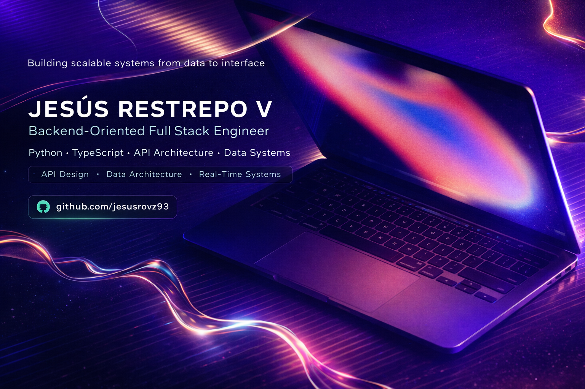

<p align="center">

</p>

<p align="center">

</p>

<p align="center">

</p>

---

# System.out.println("Hello World 👋")

```bash
whoami

Jesús Restrepo V
Backend-Oriented Full Stack Engineer

Location: Bogotá, Colombia
Remote: Global / International Projects

Focus:
- Backend Architecture
- API Development
- Data Systems
```

---

# Professional Profile

Electrical Engineer transitioning into **Backend and Full Stack Development** with strong foundations in **Python, JavaScript, TypeScript and database systems**.

Experienced in **digital transformation initiatives, real-time data visualization systems and secure application architecture**.

Passionate about building **scalable software systems** that connect data, applications and decision-making.

Areas of interest:

* Backend Engineering
* API Architecture
* Data Systems
* Fintech
* Energy Technology
* Scalable Web Platforms

---

# Education

**Master in Full Stack Development (In Progress)**
Conquer Blocks & IEAD - Instituto Europeo de Alta Dirección

**Electrical Engineering Degree**
Universidad Nacional de Colombia

---

# Professional Experience

## Digital Transformation Lead — Eaton

Led digital transformation initiatives across the **North Andean region** for operational, commercial and financial systems.

Key contributions:

* Led a **cross-functional team of 3 engineers** implementing regional digitalization.
* Centralized **financial, sales and operational KPIs into real-time dashboards** used by executive leadership.
* Built **real-time data visualization systems integrating financial, technical and commercial datasets**.
* Ensured compliance with **corporate governance and security standards**.

---

# Tech Stack

## Programming Languages


---

## Backend

REST APIs
Authentication (JWT)
Database Design
Data Visualization Systems

---

## Frontend

HTML5
CSS3
Vanilla JavaScript

---

## Tools & Infrastructure

Git
GitHub
Terminal
Firebase
Cloud Deployment

---

# Engineering Principles

Clean Code
SOLID Principles
CRUD Architecture
Agile Methodologies

---

# Highlight Project

## Liga Mundialista

Full-stack web application for **tournament management and user interaction**.

Responsibilities:

* Backend architecture
* Authentication system
* Data persistence
* API structure
* Clean application architecture

Currently in **implementation phase**.

---

# Leadership & Soft Skills

Strategic Thinking
Analytical Mindset
Cross-Functional Communication

Leadership experience managing teams of **up to 45 personnel** across multiple operational environments.

Experience collaborating with international teams across:

Brazil
Chile
USA
China
EMEA

---

# GitHub Stats

<p align="center">


</p>

---

# Contribution Activity

<p align="center">


</p>

---

# Languages

Spanish — Native
English — B2
Portuguese — C1

---

# Connect With Me

GitHub
https://github.com/jesusrovz93

LinkedIn
https://linkedin.com/in/jesus-restrepo-7a9307143

Email
[jesus.restrepov@gmail.com](mailto:jesus.restrepov@gmail.com)

---

<p align="center">

Engineering systems that transform data into decisions.

</p>


